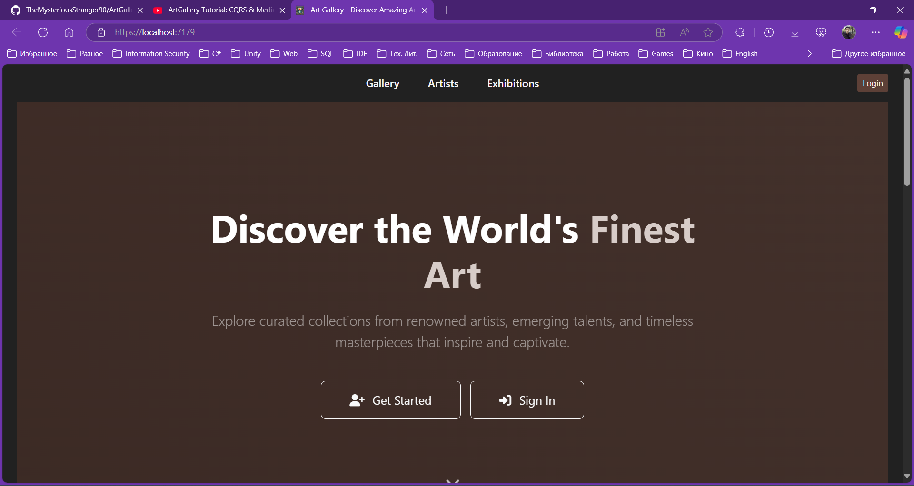
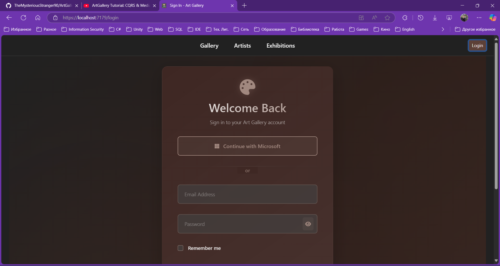
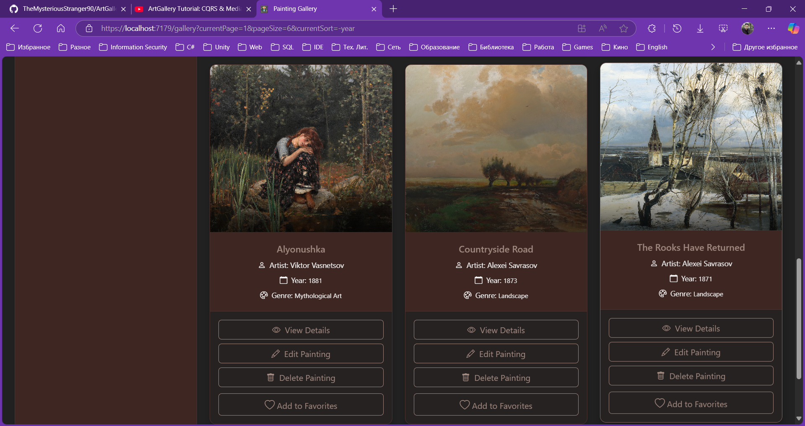
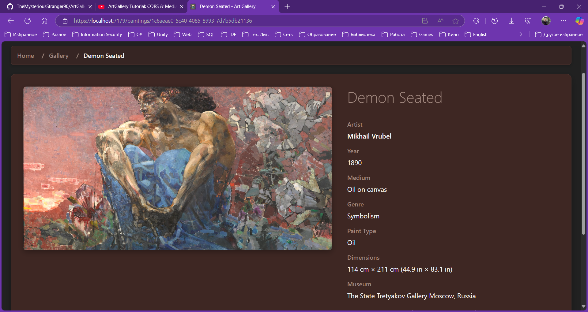
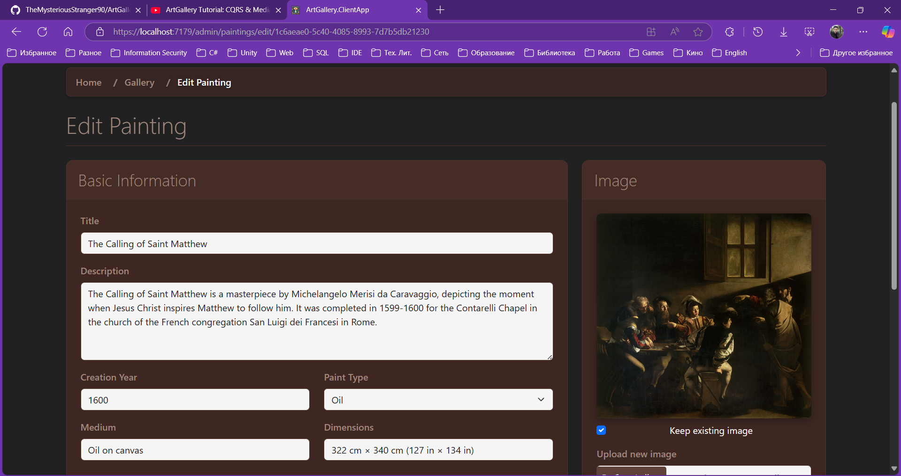

# 🎨 ArtGallery - Modern Art Gallery Management System

A comprehensive, modern art gallery management system built with ASP.NET, Blazor WebAssembly, and Docker. This application provides a complete solution for managing artists, paintings, exhibitions, and museums with advanced features like search, favorites, user management, and monitoring.

## 📋 Table of Contents

- [Features](#features)
- [Architecture](#architecture)
- [Technology Stack](#technology-stack)
- [Prerequisites](#prerequisites)
- [Quick Start](#quick-start)
- [Configuration](#configuration)
- [API Documentation](#api-documentation)
- [Monitoring & Observability](#monitoring--observability)
- [Authentication](#authentication)
- [Screenshots](#screenshots)
- [Contributing](#contributing)
- [License](#license)

## ✨ Features

### Core Features
- **Artist Management**: Full CRUD operations for artists with biographical information
- **Painting Management**: Comprehensive painting catalog with image upload to Cloudinary
- **Exhibition Management**: Create and manage art exhibitions with date ranges
- **Museum Integration**: Link paintings and exhibitions to specific museums
- **Advanced Search**: Full-text search with filtering by artist, genre, type, and date ranges
- **User Favorites**: Users can save favorite artists and paintings

### Advanced Features
- **Role-Based Access Control**: Admin and User roles with different permissions
- **External Authentication**: Microsoft OAuth integration
- **Real-time Monitoring**: Prometheus metrics and Grafana dashboards
- **Distributed Tracing**: OpenTelemetry integration
- **Centralized Logging**: Elasticsearch and Kibana for log analysis
- **Caching**: In-memory caching for improved performance
- **Rate Limiting**: API rate limiting to prevent abuse
- **Health Checks**: Application health monitoring

### Security Features
- **JWT Authentication**: Secure token-based authentication
- **HTTPS/TLS**: Full TLS encryption with certificate management
- **Data Protection**: ASP.NET Core Data Protection for sensitive data
- **Input Validation**: Comprehensive input validation and sanitization
- **CORS Configuration**: Proper cross-origin resource sharing setup

## 🏗️ Architecture

The application follows Clean Architecture principles with the following layers:

```
ArtGallery/
├── ArtGallery.Domain/          # Business entities and domain logic
├── ArtGallery.Application/     # Use cases and business rules
├── ArtGallery.Infrastructure/  # External services (Cloudinary, etc.)
├── ArtGallery.Persistence/     # Data access layer (Entity Framework)
├── ArtGallery.Identity/        # Authentication and user management
├── ArtGallery.WebAPI/          # REST API controllers and middleware
├── ArtGallery.ClientApp/       # Blazor WebAssembly frontend
└── docker-compose.yml         # Container orchestration
```

### Database Architecture

The application uses **two separate databases** for optimal security and separation of concerns:

1. **ArtGalleryDB** - Main application database containing:
    - Artists and their biographical information
    - Paintings with metadata and Cloudinary image references
    - Exhibitions and their associated paintings
    - Museums and gallery information
    - User favorites (paintings and artists)

2. **ArtGalleryIdentityDB** - Identity and authentication database containing:
    - User accounts and profiles (`ApplicationUser`)
    - Roles and permissions (`AppRole`)
    - Authentication tokens and claims
    - Password hashes and security stamps
    - External login providers data

This separation provides:
- **Enhanced Security**: User credentials isolated from business data
- **Better Performance**: Optimized queries for each domain
- **Easier Maintenance**: Independent database migrations and backups
- **Compliance**: Simplified user data management for GDPR/privacy requirements

### Design Patterns Used
- **CQRS (Command Query Responsibility Segregation)**: Separate read and write operations
- **Mediator Pattern**: Decoupled request/response handling with MediatR
- **Repository Pattern**: Data access abstraction
- **Unit of Work**: Transaction management

## 🛠️ Technology Stack

### Backend
- **ASP.NET Core Web API**: RESTful API development
- **Entity Framework Core**: Object-relational mapping
- **SQL Server**: Primary database (dual database setup)
- **MediatR**: Mediator pattern implementation
- **FluentValidation**: Input validation
- **AutoMapper**: Object mapping
- **Serilog**: Structured logging

### Frontend
- **Blazor WebAssembly**: Client-side web framework
- **Bootstrap 5**: CSS framework
- **JavaScript Interop**: For enhanced functionality

### Infrastructure
- **Docker & Docker Compose**: Containerization
- **Elasticsearch**: Search and logging
- **Kibana**: Log visualization
- **Prometheus**: Metrics collection
- **Grafana**: Metrics visualization
- **OpenTelemetry**: Distributed tracing

### External Services
- **Cloudinary**: Image storage and transformation
- **Microsoft Graph API**: External authentication

## 📋 Prerequisites

Before you begin, ensure you have the following installed:

- **Docker Desktop** (latest version)
- **Docker Compose** (v3.8+)
- **.NET 8 SDK** (for local development)
- **Node.js** (v18+ for frontend development)
- **OpenSSL** (for certificate generation)

## 🚀 Quick Start

### 1. Clone the Repository

### 2. Generate SSL Certificates
```powershell
# Windows
.\Generate-Certificates.ps1
```

### 3. Configure Environment Variables
```bash
# Copy and configure environments file (.env for development and .env.production for production) 
cp .env .env.production

# Edit .env.production with your settings
```

### 4. Start the Application
```bash
# Start all services
docker-compose up -d

# Check service status
docker-compose ps
```

### 5. Access the Application
- **Web Application**: https://localhost:8083
- **API Documentation**: https://localhost:8081/docs
- **Grafana**: http://localhost:3000 (admin/admin)
- **Kibana**: http://localhost:5601
- **Prometheus**: http://localhost:9090

## ⚙️ Configuration

### Environment Variables

Create a `.env.production` file in the root directory:

```bash
# JWT Configuration
JWT_KEY=your-super-secret-jwt-key-minimum-32-characters-long
JWT_ISSUER=https://localhost:8081
JWT_AUDIENCE=https://localhost:8081

# Cloudinary Configuration
CLOUDINARY_CLOUD_NAME=your-cloud-name
CLOUDINARY_API_KEY=your-api-key
CLOUDINARY_API_SECRET=your-api-secret

# External Authentication
MICROSOFT_CLIENT_ID=your-microsoft-client-id
MICROSOFT_CLIENT_SECRET=your-microsoft-client-secret

# Database Configuration (optional - defaults provided)
SQL_SERVER_PASSWORD=YourStrong!Password
```

### Database Configuration

The application automatically manages two databases:

```bash
# Main application database
ArtGalleryDbConnection=Server=sqlserver;Database=ArtGalleryDB;User=sa;Password=YourStrong!Password;TrustServerCertificate=True;

# Identity/authentication database  
ArtGalleryIdentityDbConnection=Server=sqlserver;Database=ArtGalleryIdentityDB;User=sa;Password=YourStrong!Password;TrustServerCertificate=True;
```

Both databases are automatically:
- Created during first startup
- Migrated to latest schema
- Seeded with initial data (including default users)

### Default Users

The system creates these default users during initial setup:

| Email | Password | Role | Description |
|-------|----------|------|-------------|
| admin@artgallery.com | Admin@123! | Administrator | Full system access |
| curator@artgallery.com | Curator@123! | Moderator | Content management |
| maria@example.com | User@123! | User | Regular user |
| alex@example.com | User@123! | User | Regular user |
| sophia@example.com | User@123! | User | Regular user |

### SSL Certificates

The application requires SSL certificates for HTTPS. You can:

1. **Use the provided generation scripts** (recommended for development)
2. **Use your own certificates** (place them in the `certificates/` folder)
3. **Use Let's Encrypt certificates** (for production)

### API Rate Limiting

Default rate limits (configurable in appsettings.json):
- **Authentication**: 5 requests per minute
- **Registration**: 3 requests per minute
- **General API**: 100 requests per minute

## 🔧 Development

### Local Development Setup

1. **Install dependencies**:
```bash
dotnet restore
```

2. **Update database**:
```bash
# Update main application database
dotnet ef database update --project ArtGallery.Persistence

# Update identity database
dotnet ef database update --project ArtGallery.Identity
```

3. **Run the API**:
```bash
cd ArtGallery.WebAPI
dotnet run
```

4. **Run the client app**:
```bash
cd ArtGallery.ClientApp
dotnet run
```

### Database Migrations

```bash
# Add new migration for main database
dotnet ef migrations add MigrationName --project ArtGallery.Persistence

# Add new migration for identity database
dotnet ef migrations add MigrationName --project ArtGallery.Identity

# Update databases
dotnet ef database update --project ArtGallery.Persistence
dotnet ef database update --project ArtGallery.Identity

# Remove last migration
dotnet ef migrations remove --project ArtGallery.Persistence
dotnet ef migrations remove --project ArtGallery.Identity
```

### Code Quality

We use the following tools to maintain code quality:
- **FluentValidation**: Input validation
- **StyleCop**: Code style analysis
- **Unit Tests**: xUnit testing framework

## 📖 API Documentation

The API is fully documented using OpenAPI/Swagger. Access the interactive documentation at:
- **Development**: https://localhost:8081/docs

### Key API Endpoints

#### Authentication
- `POST /api/account/register` - User registration
- `POST /api/account/authenticate` - User login
- `POST /api/account/microsoft-auth` - Microsoft OAuth

#### Artists
- `GET /api/artists` - Get paginated artists list
- `GET /api/artists/{id}` - Get artist details
- `POST /api/artists` - Create new artist (Admin only)
- `PUT /api/artists/{id}` - Update artist (Admin only)
- `DELETE /api/artists/{id}` - Delete artist (Admin only)

#### Paintings
- `GET /api/paintings` - Get paginated paintings list
- `GET /api/paintings/{id}` - Get painting details
- `POST /api/paintings` - Create new painting (Admin only)
- `PUT /api/paintings/{id}` - Update painting (Admin only)
- `DELETE /api/paintings/{id}` - Delete painting (Admin only)

#### Exhibitions
- `GET /api/exhibitions` - Get all exhibitions
- `GET /api/exhibitions/current` - Get current exhibitions
- `GET /api/exhibitions/upcoming` - Get upcoming exhibitions
- `POST /api/exhibitions` - Create exhibition (Admin only)

## 📊 Monitoring & Observability

### Metrics (Prometheus + Grafana)
- **Application Metrics**: Request rates, response times, error rates
- **System Metrics**: CPU, memory, disk usage
- **Business Metrics**: User registrations, paintings created, favorites

### Logging (Elasticsearch + Kibana)
- **Structured Logging**: JSON-formatted logs with contextual information
- **Log Levels**: Error, Warning, Information, Debug
- **Search & Analytics**: Full-text search and log analysis

### Tracing (OpenTelemetry)
- **Distributed Tracing**: Request flow across services
- **Performance Monitoring**: Identify bottlenecks
- **Error Tracking**: Trace errors through the system

### Health Checks
- **Database Connectivity**: SQL Server health (both databases)
- **External Services**: Elasticsearch, Cloudinary
- **Application Health**: Memory usage, response times

Access monitoring tools:
- **Grafana**: http://localhost:3000 (admin/admin)
- **Kibana**: http://localhost:5601
- **Prometheus**: http://localhost:9090

## 🔐 Authentication

### Supported Authentication Methods

1. **Local Authentication**: Username/password with JWT tokens
2. **Microsoft OAuth**: Integration with Microsoft accounts
3. **Role-Based Access**: Administrator, Moderator, and User roles

### User Roles

#### User Role
- View artists, paintings, and exhibitions
- Manage personal favorites
- Update personal profile

#### Moderator Role
- All User permissions
- Content moderation capabilities
- Limited administrative functions

#### Administrator Role
- All User and Moderator permissions
- Create, update, delete artists
- Create, update, delete paintings
- Manage exhibitions
- User management
- Access to admin dashboard
- System configuration

### JWT Token Configuration

Tokens include:
- **Expiration**: 1 hour (configurable)
- **Refresh**: Automatic refresh mechanism
- **Claims**: User ID, email, roles
- **Encryption**: HS256 algorithm

## Screenshots








## Contributing

Contributions are welcome. Please fork the repository and create a pull request with your changes.

## Author

**Bohdan Harabadzhyu**

## License

[MIT](https://choosealicense.com/licenses/mit/)